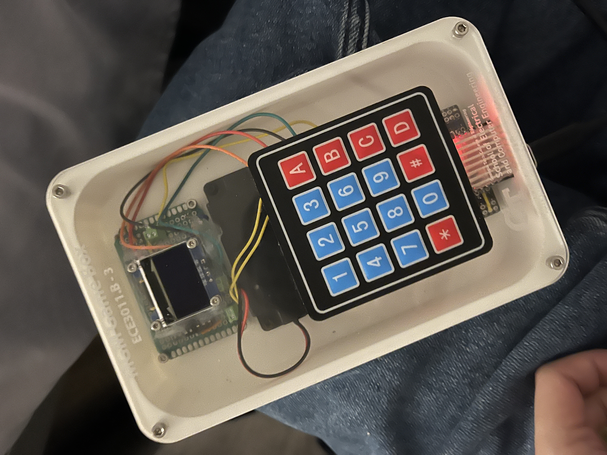

# ECE-3011-Junior-Design
Junior Design project

https://github.com/Ian-Boraks/ECE3011-STEAM/tree/Feedback


# About This Project

## 📚 Educational Gameboy using ESP32

This project showcases an **educational Gameboy** designed using the ESP32 microcontroller. The Gameboy integrates various peripherals and features to provide an engaging learning experience for students, focusing on math and music skills. 

## Key Features
- **Microcontroller**: ESP32 for efficient processing and Wi-Fi capabilities.
- **Display**: A colorful LCD screen to render interactive content.
- **Input**: Capacitive touch buttons and a navigation switch for user interaction.
- **Feedback Mechanisms**: Integrated speakers and haptic feedback for immersive learning.

## Highlights in Code

### 1. Display Initialization
The following code snippet demonstrates how the LCD display was initialized to render the game's user interface:

```cpp
#include <TFT_eSPI.h>

TFT_eSPI tft = TFT_eSPI(); // Initialize TFT library

void setupDisplay() {
    tft.init();
    tft.setRotation(1);
    tft.fillScreen(TFT_BLACK);
    tft.setTextColor(TFT_WHITE, TFT_BLACK); // Set text color
    tft.setTextDatum(MC_DATUM); // Center alignment
}
```

### 2. Sound Feedback
Using the ESP32's PWM capabilities, the speaker plays sound effects based on user input:

```cpp
void playTone(int frequency, int duration) {
    ledcAttachPin(10, 0); // Attach GPIO 10 to channel 0
    ledcWriteTone(0, frequency); // Set frequency
    delay(duration);
    ledcWriteTone(0, 0); // Stop sound
}
```

### 3. Tap Detection with the Microphone
The microphone setup detects tap events for input recognition:

```cpp
void detectTap() {
    int soundLevel = analogRead(A0);
    if (soundLevel > THRESHOLD) {
        Serial.println("Tap detected!");
    }
}
```

## Repository Structure
```plaintext
├── code/
│   ├── src/
│   │   ├── main.cpp       # Main program logic
│   │   ├── display.cpp    # Display handling code
│   │   ├── sound.cpp      # Sound feedback logic
│   │   ├── input.cpp      # User input processing
│   └── assets/
│       ├── icons/         # Game icons
│       └── sounds/        # Sound effects
└── README.md              # Project documentation
```

## Product Image



